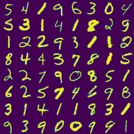

# VAE with Gumbel-Softmax

TensorFlow implementation of a Variational Autoencoder with Gumbel-Softmax Distribution. Refer to the following paper:

* [Categorical Reparametrization with Gumbel-Softmax](https://arxiv.org/pdf/1611.01144.pdf) by Maddison, Mnih and Teh
* [The Concrete Distribution: A Continuous Relaxation of Discrete Random Variables](https://arxiv.org/pdf/1611.00712.pdf) by Jang, Gu and Poole
* [REBAR: Low-variance, unbiased gradient estimates for discrete latent variable models](https://arxiv.org/pdf/1703.07370.pdf) by Tucker, Mnih, Maddison and Sohl-Dickstein

Also, included is a jupyter notebook which shows how the Gumbel-Max trick for sampling discrete variables relates to Concrete distributions.

## Table of Contents
* [Installation](#installation)
* [Ananconda](#anaconda)
* [Docker](#docker)
* [Results](#results)

## Installation

The program requires the following dependencies (easy to install using pip, Ananconda or Docker):

* python 2.7/3.5
* tensorflow (tested with r1.1 and r1.5)
* numpy
* holoviews
* jupyter
* pandas
* matplotlib
* seaborn
* tqdm

## Anaconda

### Anaconda: CPU Installation

To install VAE-Gumbel-Softmax in an TensorFlow 1.5 CPU - Python 2.7 environment:

```python
conda env create -f tf_py26_cpu_env.yml
```

To activate Anaconda environment:

```python
source activate tf-py26-cpu-env
```

### Anaconda: GPU Installation

To install VAE-Gumbel-Softmax in an TensorFlow 1.5 GPU - Python 3.5 environment:

```python
conda env create -f tf_py35_gpu_env.yml
```

To activate Anaconda environment:

```python
source activate tf-py35-gpu-env
```

### Anaconda: Train

Train VAE-Gumbel-Softmax model on the local machine using MNIST dataset:

```python
python vae_gumbel_softmax.py
```

## Docker

Train VAE-Gumbel-Softmax model using Docker on the MNIST dataset:

```shell
docker build -t vae-gs .
docker run vae-gs
```

Note: Current Dockerfile is for TensorFlow 1.5 CPU training.

## Results

### Hyperparameters
```python
Batch Size:                         100
Number of Iterations:               50000
Learning Rate:                      0.001
Initial Temperature:                1.0
Minimum Temperature:                0.5
Anneal Rate:                        0.00003
Straight-Through Gumbel-Softmax:    False
KL-divergence:                      Relaxed
Learnable Temperature:              False
```

### MNIST
| Ground Truth 	| Reconstructions 	|
|:------------:	|:---------------:	|
| | |
